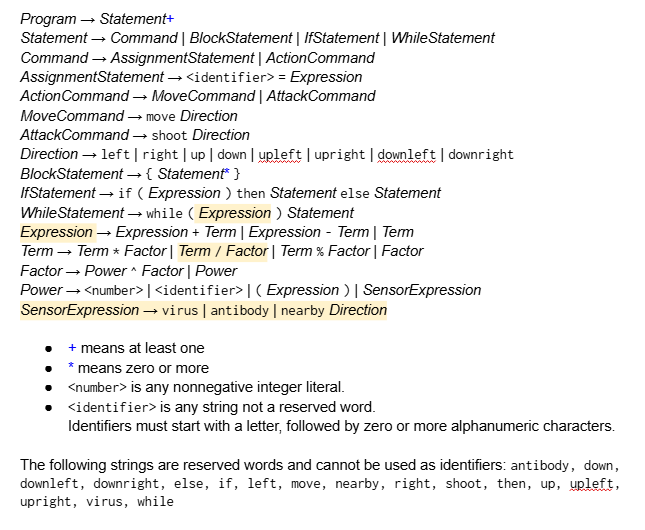
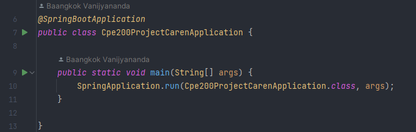

## CPE200-Project-CAREN

# Introduction

CAREN is a simulation game of a battle between viruses and antibodies in your body. Both have their unique genetic codes which determine their behavior.
Genetic codes are written using a specified grammar as per stated in the project specification.
The game must be run on a web page with a Java back-end which handles all the non-visual computation of the game.

[Design Document](CPE200_Project___CAREN___Design_Overview_Document.pdf)
[Design Overview Document - Overleaf](https://www.overleaf.com/read/hvmncgvczwhf)

## The Grammar

The grammar for our genetic codes are based on this image, but we modified it to fit the real-time + no grid nature of our game. The modifications can be found in the design document.

Example genetic codes can be found in a `/back-end/genetic-codes/sampleteam/working/sampleteam_w0`

## Running the Game

* the backendserver
  * open `back-end` as the root folder in IntelliJ
  * run `Cpe200ProjectCarenApplication`
  * 
* the display (where you play the game)
  * cd to `/front-end/cpe200-project-caren`
  * run `npm install` or do a clean install
  * run `npm start`
  * go to `http://localhost:3000/iambaangkok/CPE200-Project-CAREN` to play
  * you may need to refresh the page 1 or 2 times

### Controls

* you only need the mouse
* buy antibodies using the button at the right
* click in one of the three organs to open a scanner
  * click outside the scanner to exit the scanner
* click the button on the right of the scanner to select which antibody to place, click the selected button to unselect
  * click on the scanner screen to place an antibody
  * click on an antibody *on the screen* while **no buttons are selected** to **pickup** that antibody
* you must place at least 1 antibody in each organs for the game to start
* you must clear the viruses in each organs to complete each wave
* there are speed settings in the top left
* restart the backend server to restart the game
